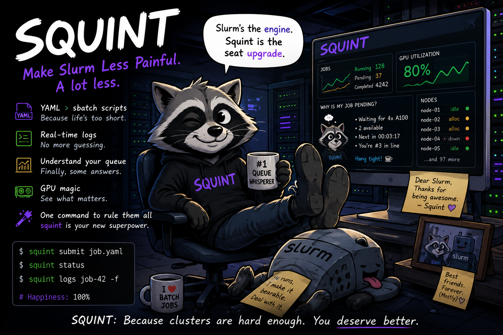
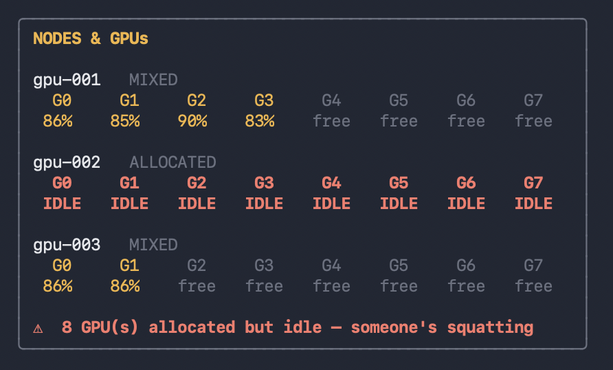
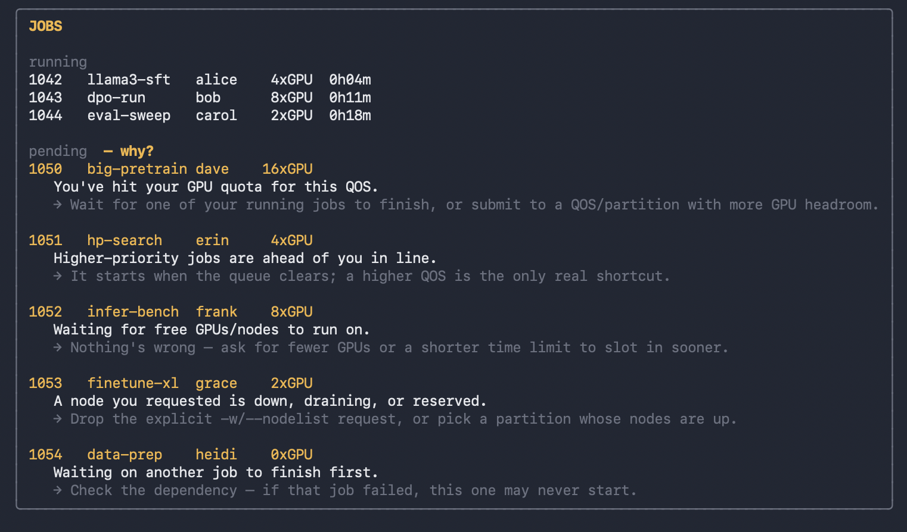
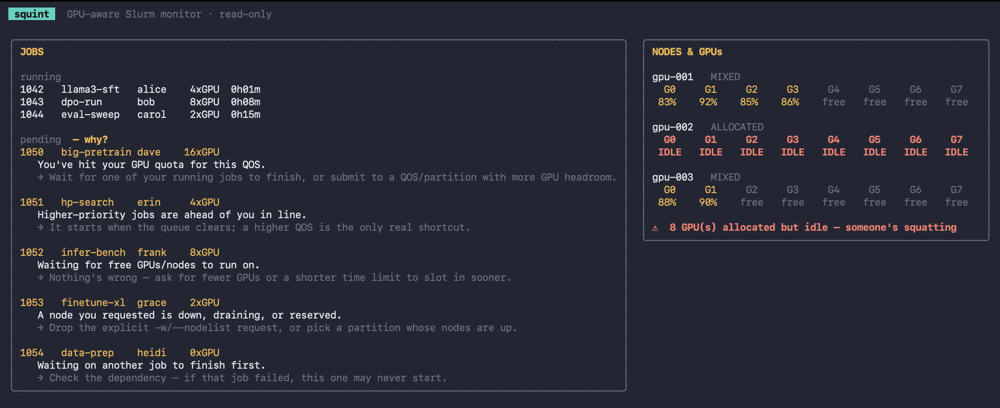

# Squint 🦝🐾

**A GPU-aware Slurm monitor for your terminal. Read-only, zero-config, runs anywhere.**




It's read-only by design: it only ever runs `squeue` / `sacct` / `scontrol` and reads DCGM. Nothing to trust it with, nothing it can break. Point it at a cluster and look.

```bash
    # Install Squint
    brew install hiteshsahu/tap/squint   # (planned)
    
    go install github.com/hiteshsahu/squint@latest
```

Then just:

```bash
  squint  
```

No cluster handy? It ships with a mock source, so `squint` runs on your laptop out of the box.

---

## Why squint

Slurm is powerful but feels like infrastructure from another era `squeue` is hard to read, "why is my job pending?" is a dark art, and nothing shows you what the GPUs are *actually doing*. `squint` is the live, GPU-native view of your cluster, in your shell, right now.

Two things nothing else in the Slurm ecosystem does well:

### 1. Find the Squatter GPU  
Every GPU on every node, colored by utilization and mapped to the job that owns it so the eight A100s allocated to a job using none of them light up red.

**GPU heatmap with idle-shaming.**



That's the "who's squatting?" view every platform team wants and no Slurm tool gives them.

### 2. **"Why is my job pending?" in plain English.** 
`Reason=(QOSMaxGRESPerUser)` becomes *"You've hit your GPU quota for this QOS — wait for a running job to finish, or submit somewhere with more headroom."* For every common reason code, with the fix.



---

## Run from source

Requires **Go 1.22+**.

```bash
    # Install dependencies
    go mod tidy
    
    # Run the Engine
    go run .
    
    # Optional : Build & format before commit
    gofmt -w . && go build ./...
```



Keys: `q` quit · `r` refresh. Polls every 2s.


---


## How Squint is Built


```text

    ┌────────────────────────────────────────────┐
    │                 Squint CLI                 │
    │     submit • status • logs • dashboard     │
    └──────────────────┬─────────────────────────┘
                       │
                       ▼
    ┌────────────────────────────────────────────┐
    │              Source Layer                  │
    │  Mock Source • Slurm Source • Future APIs  │
    └──────────────────┬─────────────────────────┘
                       │
                       ▼
    ┌────────────────────────────────────────────┐
    │             Scheduler Engine               │
    │  Queue Analysis • Pending Explanation      │
    │  GPU Allocation Insights                   │
    └──────────────────┬─────────────────────────┘
                       │
                       ▼
    ┌────────────────────────────────────────────┐
    │                  Slurm                     │
    │  squeue • sacct • sinfo • slurmrestd       │
    └────────────────────────────────────────────┘
    
```

Folder structure


```bash

squint/
    ├── cmd/
    │   └── squint/
    │       └── main.go                 # CLI entrypoint
    ├── internal/
    │   ├── config/
    │   │   └── config.go               # config loading and defaults
    │   │
    │   ├── model/
    │   │   ├── job.go
    │   │   ├── node.go
    │   │   ├── gpu.go
    │   │   └── snapshot.go
    │   │
    │   ├── source/
    │   │   ├── source.go               # Source interface . Mock (runs anywhere) · Live (stub)
    │   │   ├── mock/
    │   │   │   └── source.go           # local demo data
    │   │   └── slurm/
    │   │       ├── jobs.go
    │   │       ├── nodes.go
    │   │       ├── gpu.go
    │   │       └── pending.go          # Slurm reason-code → plain-English translator
    │   │
    │   ├── collector/
    │   │   ├── jobs.go
    │   │   ├── nodes.go
    │   │   └── metrics.go
    │   │
    │   ├── scheduler/
    │   │   └── explain.go              # "why is my job pending?"
    │   │
    │   ├── tui/
    │   │   ├── app.go                 # Bubble Tea model: poll, fetch, keys
    │   │   ├── view.go                # Lip Gloss rendering: heatmap + jobs panel
    │   │   ├── keymap.go
    │   │   └── theme.go
    │   │
    │   └── api/
    │       ├── server.go
    │       └── handlers.go
    │
    ├── web/
    │   └── dashboard/                  # future React/Next.js UI
    │
    ├── examples/
    │   ├── train.yaml
    │   ├── inference.yaml
    │   └── gpu-burn.yaml
    │
    ├── assets/
    │   ├── banner.png
    │   └── screenshots/
    │
    ├── docs/
    │   ├── architecture.md
    │   ├── slurm-integration.md
    │   └── pending-reasons.md
    │
    ├── .github/
    │   └── workflows/
    │
    ├── go.mod
    ├── README.md
    └── LICENSE  
      
      
```

The `Source` interface is the whole seam: 
- `Mock` today, 
- `Live` (squeue/sacct/scontrol `--json` + `dcgmi`, with an `nvidia-smi` fallback) next. 
- The TUI never knows the difference.


---

## Roadmap

`squint` grows up one rung at a time — each earns the right to the next.

- **L0 — Observe** *(here)* — read-only GPU-aware TUI.
- **L1 — Act** — cancel / hold / requeue from the TUI; job-done desktop & Slack pings.
- **L2 — Declare** — clean job specs with pre-submit validation; `squint rerun <jobid>`.
- **L3 — API** — a friendly daemon over Slurm with a real job-state event stream.

It also emits Prometheus metrics, so it can feed a longer-term observability stack rather than replace one.

---

## License
*© 2026 [Hitesh Kumar Sahu](https://hiteshsahu.com) · Licensed under [Apache 2.0](https://www.apache.org/licenses/LICENSE-2.0)*

